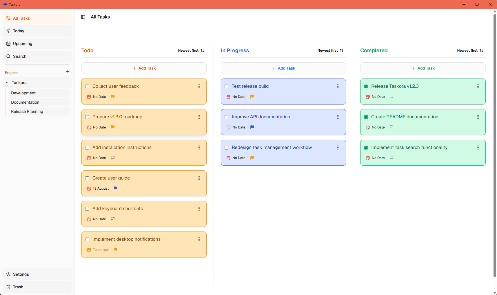
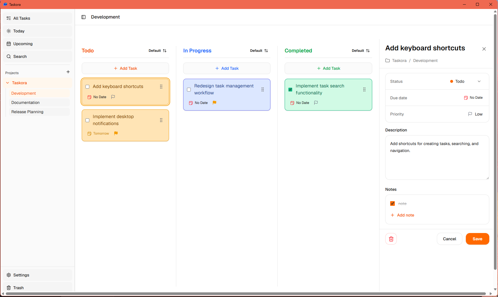
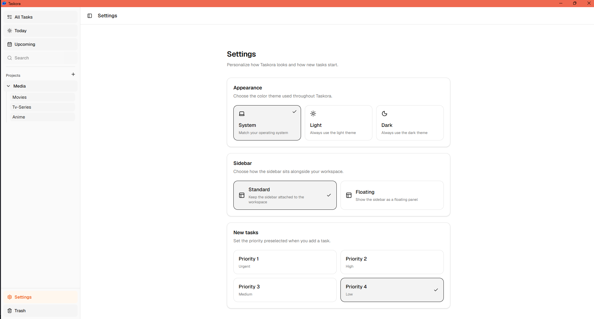
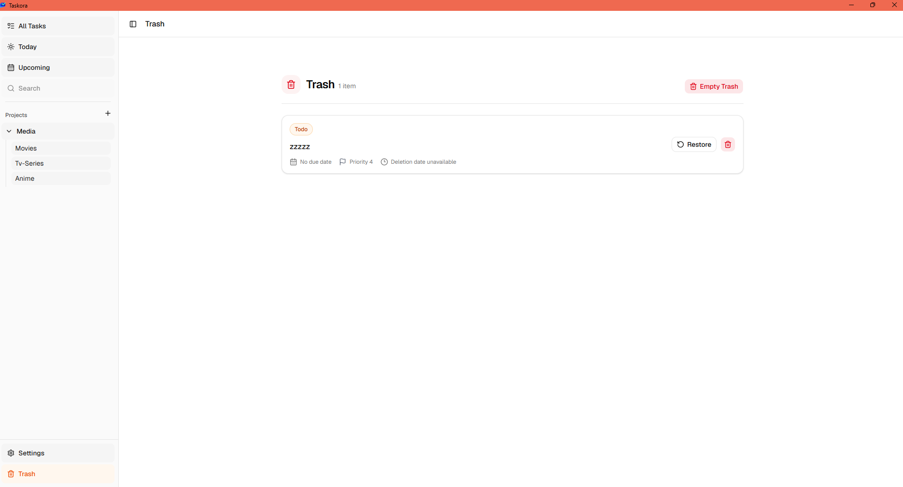
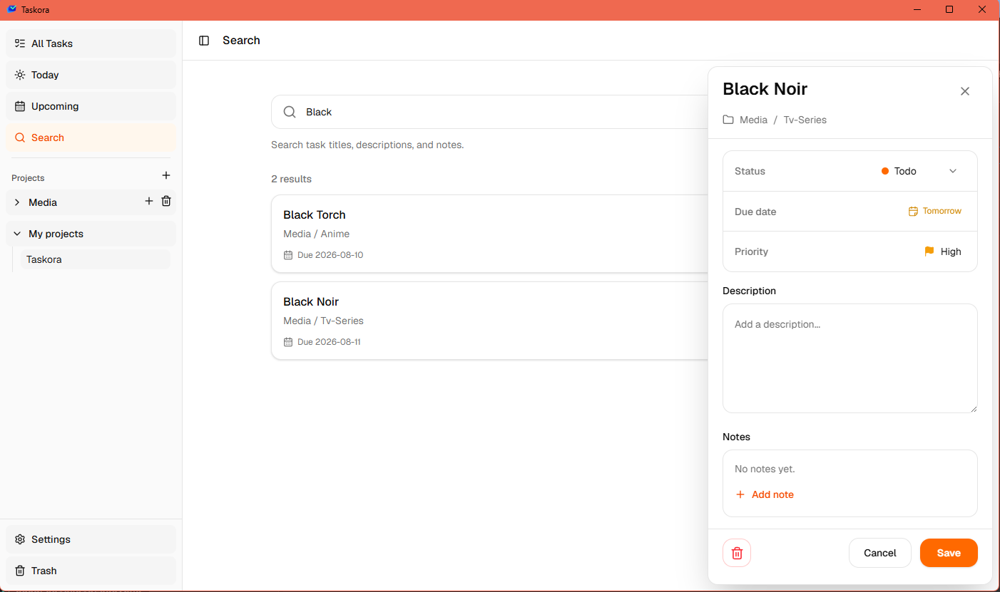

<p align="center">
  
</p>

<h1 align="center">Taskora</h1>

<p align="center">
  A local-first desktop Kanban app for planning personal work with focus.
</p>

<p align="center">
  <a href="https://github.com/HexCore99/taskora/releases">Download</a>
  ·
  <a href="#demo">Demo</a>
  ·
  <a href="#run-from-source">Run from source</a>
  ·
  <a href="#features">Features</a>
</p>



## Demo

[Watch or download the Taskora overview demo](<docs/demo/Taskora-Overview-2026-08-10 19-23-54.mkv>).

## Why Taskora?

Taskora keeps your work organized without requiring an account or sending your data to a third-party service. Create projects and boards, move tasks through a clear Kanban workflow, and keep task details, notes, and preferences on your own device.

## Features

- **Projects and boards** — Group related work into projects, then create focused boards inside them.
- **Kanban workflow** — Manage tasks across **Todo**, **In Progress**, and **Completed**. Drag tasks to move or reorder them; new tasks start at the top of their column.
- **Focused task details** — Edit a task's title, status, description, due date, priority, and notes from the details panel.
- **Priorities and due dates** — Choose Priority 1–4, set a date from the calendar, or use quick Today, Tomorrow, and No date actions.
- **Flexible views and sorting** — Switch between All Tasks, Today, and Upcoming. Sort each column by its manual order, priority, or due date.
- **Personal settings** — Choose Light, Dark, or System theme; use a standard or floating sidebar; and set the default priority for new tasks.
- **Trash before deletion** — Deleted tasks go to Trash, where they can be restored, permanently deleted, or cleared in one action.
- **Local persistence** — Tasks and boards are stored in SQLite, while your sidebar, sorting, theme, and task-default preferences are stored locally in YAML.

## Screenshots

<table>
  <tr>
    <td width="50%">
      <strong>Task details</strong><br /><br />
      
    </td>
    <td width="50%">
      <strong>Settings</strong><br /><br />
      
    </td>
  </tr>
  <tr>
    <td width="50%">
      <strong>Trash</strong><br /><br />
      
    </td>
    <td width="50%">
      <strong>Search</strong><br /><br />
      
    </td>
  </tr>
</table>

## Download

Get the latest installer from [GitHub Releases](https://github.com/HexCore99/taskora/releases). Windows releases include an `.exe` installer and an `.msi` package. Other platform bundles are published when available.

## Run from source

### Prerequisites

- [Bun](https://bun.sh/)
- [Rust](https://www.rust-lang.org/tools/install)
- The platform prerequisites from the [Tauri documentation](https://v2.tauri.app/start/prerequisites/)

### Start the desktop app

```bash
git clone https://github.com/HexCore99/taskora.git
cd taskora
bun install
bun run tauri dev
```

Taskora uses Tauri commands for local persistence, so run it through `bun run tauri dev` rather than a browser-only Vite preview.

### Create a production build

```bash
bun run tauri build
```

The generated installers and platform bundles are written to:

```text
src-tauri/target/release/bundle/
```

## Local data and privacy

Taskora is local-first. It has no account system or cloud sync: your task data stays on your device.

On Windows, Taskora stores its files in:

```text
%APPDATA%\com.hexcr.taskora\
```

| File | Purpose |
| --- | --- |
| `todo.db` | SQLite database containing projects, boards, tasks, task notes, and their ordering. |
| `ui_config.yaml` | Theme, sidebar state, column sorting, and default task priority. |

To back up your data, copy this folder while Taskora is closed.

## Tech stack

| Layer | Technology |
| --- | --- |
| Desktop runtime | [Tauri 2](https://v2.tauri.app/) and Rust |
| Interface | React 19 and Vite |
| State | Zustand |
| Storage | SQLite via Rusqlite and YAML preferences |
| Drag and drop | dnd-kit |
| Styling | Tailwind CSS, Radix UI, and Lucide icons |
| Package manager | Bun |

## Project structure

```text
src/                     React interface, components, hooks, and Zustand stores
src-tauri/src/           Rust commands, SQLite schema, migrations, and UI config
src-tauri/icons/         Application icons for desktop platforms
docs/screenshots/        README screenshots
docs/demo/               Product overview demo
.github/workflows/       CI and release automation
```

## Contributing

Ideas, bug reports, and pull requests are welcome. For substantial changes, please open an [issue](https://github.com/HexCore99/taskora/issues) first so the approach can be discussed.
